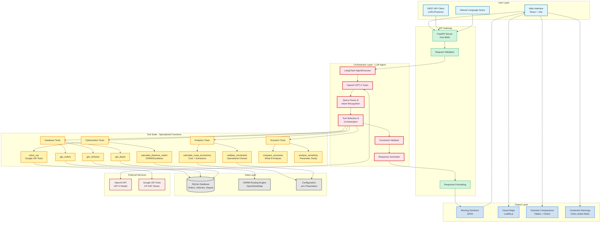

# System Architecture Diagrams for Research Paper

## Mermaid Diagram (Can be rendered to PNG/SVG)

---

## Detailed Architecture Description

### Layer 1: User Interfaces
- **Web Interface**: React-based SPA with interactive maps (Leaflet.js), real-time query execution
- **REST API**: Direct programmatic access via HTTP endpoints (`/ask`, `/solve_vrp_direct`, `/compare_scenarios`)
- **Natural Language Input**: Conversational queries in plain English

### Layer 2: API Gateway (FastAPI)
- **Request Routing**: Directs queries to appropriate endpoints
- **Validation**: Input sanitization, parameter type checking
- **Response Formatting**: JSON serialization, error handling, CORS support

### Layer 3: Orchestrator (LLM Agent - Core Intelligence)
- **LangChain AgentExecutor**: Manages agent reasoning loop (thought → action → observation)
- **GPT-4 Turbo**: Natural language understanding, tool selection, response generation
- **Query Parser**: Extracts entities, constraints, objectives from user queries
- **Tool Orchestrator**: Sequences function calls, passes data between tools
- **Constraint Validator**: Post-optimization checks for driver hours, cold-chain limits, capacity
- **Response Generator**: Synthesizes natural language explanations with metrics

### Layer 4: Tool Suite (9 Specialized Functions)

#### Database Tools (3):
1. **get_orders**: Fetch delivery orders with filtering (priority, cold-chain, region)
2. **get_vehicles**: Retrieve available vehicles with type/capacity filters
3. **get_depot**: Get distribution center coordinates and metadata

#### Optimization Tools (2):
4. **solve_vrp**: Google OR-Tools CP-SAT solver for VRPTW
5. **calculate_distance_matrix**: OSRM road network distances or Euclidean fallback

#### Analytics Tools (2):
6. **calculate_route_economics**: Fuel cost, labor cost, emissions calculation
7. **validate_constraints**: Operational feasibility checks (driver hours, time windows)

#### Scenario Planning Tools (2):
8. **compare_scenarios**: Parallel what-if analysis (fuel prices, fleet size, traffic)
9. **analyze_sensitivity**: Parameter sweep analysis (single variable impact study)

### Layer 5: Data Layer
- **SQLite Database**: Persistent storage for orders, vehicles, depots (50 sample orders, 10 vehicles)
- **OSRM Engine**: Real-world road network routing (OpenStreetMap-based)
- **Configuration**: Environment variables (.env) for API keys, cost parameters

### Layer 6: External Services
- **OpenAI API**: GPT-4 Turbo model access for LLM reasoning
- **Google OR-Tools**: Open-source constraint programming solver

### Layer 7: Output Layer
- **Routing Solutions**: JSON with routes, distances, times, costs
- **Visual Maps**: Interactive Leaflet.js maps with route overlays
- **Scenario Comparisons**: Tabular comparisons with percentage differences
- **Constraint Warnings**: Color-coded alerts (green/yellow/red) for violations

---

## Information Flow Example

**User Query:** *"Route 10 cold-chain orders with 2 vehicles, minimize cost"*

1. **Web UI** → FastAPI `/ask` endpoint
2. **FastAPI** → LangChain AgentExecutor
3. **GPT-4** parses query → identifies: task=routing, count=10, filter=cold_chain, vehicles=2, objective=minimize_cost
4. **Agent** calls tools in sequence:
   - `get_orders(count=10, filters={"is_cold_chain": true})` → SQLite
   - `get_vehicles(count=2)` → SQLite
   - `get_depot()` → SQLite
   - `calculate_distance_matrix(locations)` → OSRM
   - `solve_vrp(orders, vehicles, depot, objective="minimize_cost")` → OR-Tools
   - `calculate_route_economics(routes)` → Cost formulas
   - `validate_constraints(routes, cold_chain_limit=120min)` → Validation logic
5. **Agent** synthesizes response with GPT-4
6. **FastAPI** returns JSON to Web UI
7. **Web UI** renders map + tables + warnings

---

## Key Design Principles

1. **Modularity**: Each tool is independently testable and replaceable
2. **Composability**: Tools can be chained in any sequence based on query intent
3. **Transparency**: Full tool call logs available for debugging and explainability
4. **Scalability**: Stateless API design, concurrent scenario execution
5. **Reliability**: Fallback mechanisms (Euclidean distance if OSRM fails)
6. **Security**: API key management via environment variables, input sanitization

---

## Technology Stack

| Layer | Technologies |
|-------|-------------|
| Frontend | React 19, Vite, Tailwind CSS, Leaflet.js, Recharts |
| Backend | Python 3.10+, FastAPI, Uvicorn |
| AI/ML | LangChain, OpenAI GPT-4 Turbo, Function Calling API |
| Optimization | Google OR-Tools (CP-SAT), OSRM |
| Database | SQLite 3 |
| Deployment | Docker-ready, RESTful API |

---

## Performance Characteristics

- **Query Latency**: 10-40 seconds (depends on problem size)
  - LLM reasoning: 5-10s
  - OR-Tools solving: 5-25s
  - Tool orchestration: 2-5s
- **Scenario Comparison**: 60-80 seconds for 4 scenarios
- **Constraint Validation**: <1 second
- **Database Queries**: <100ms

---

## Figures for Research Paper

### Figure 1: High-Level System Architecture
**Caption:** "Modular architecture of the AI-powered logistics planning system showing four core layers: User Interfaces (Web + API), API Gateway (FastAPI), LLM Orchestrator (GPT-4 + LangChain), and Tool Suite (9 specialized functions). The system integrates external services (OpenAI, OR-Tools, OSRM) and accesses operational data (orders, vehicles, depots) to generate routing solutions with constraint validation."

### Figure 2: Tool Suite Composition
**Caption:** "Breakdown of the 9-tool suite by category: Database Tools (33%), Optimization Tools (22%), Analytics Tools (22%), and Scenario Planning Tools (22%). Each tool is implemented as a Python function with JSON input/output via LangChain's @tool decorator."

### Figure 3: Query Processing Flow
**Caption:** "Information flow for a typical logistics query showing: (1) natural language input, (2) query parsing and intent recognition, (3) tool selection and orchestration, (4) parallel tool execution, (5) constraint validation, and (6) natural language response generation. The LLM orchestrator manages the entire workflow while maintaining transparency through tool call logging."
